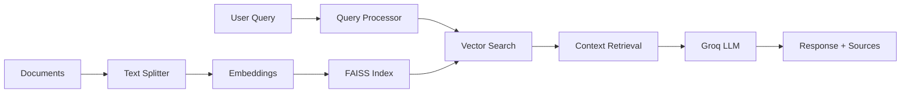

# 🤖 RAG Q&A System

**A fast, cost-effective Retrieval-Augmented Generation (RAG) system that transforms your documents into an intelligent Q&A assistant.**

[](https://python.org)
[](LICENSE)
[](https://groq.com)
[](https://github.com/facebookresearch/faiss)

## 🎬 Demo


*Experience the power of document-based AI Q&A with real-time responses and source citations.*

## 📖 Table of Contents

- [✨ Features](#-features)
- [🏗️ Architecture](#️-architecture)
- [🛠️ Tech Stack](#️-tech-stack)
- [📦 Installation](#-installation)
- [🚀 Quick Start](#-quick-start)
- [📁 Project Structure](#-project-structure)
- [⚙️ Configuration](#️-configuration)
- [💻 Usage](#-usage)
- [🔧 Development](#-development)
- [📊 Performance](#-performance)
- [🤝 Contributing](#-contributing)
- [📄 License](#-license)
- [🆘 Support](#-support)

## ✨ Features

### 🔍 **Intelligent Document Processing**
- **Multi-format support**: PDF, TXT, DOCX document ingestion
- **Smart text chunking**: Optimized RecursiveCharacterTextSplitter (1500/150 chars)
- **Semantic embeddings**: Local sentence-transformers for cost-effective processing
- **Vector search**: Lightning-fast FAISS similarity search

### 🧠 **Advanced Q&A Capabilities**
- **Context-aware responses**: Retrieval-augmented generation with Groq LLMs
- **Source attribution**: Automatic citation and source tracking
- **Real-time streaming**: Live response generation for better UX
- **Smart ranking**: Similarity-based context selection and filtering

### 🖥️ **Multiple Interfaces**
- **Web Interface**: Beautiful Streamlit-based chat application
- **CLI Tool**: Command-line interface for automation and testing
- **API Ready**: Modular design for easy API integration

### 🚀 **Production Features**
- **Cost optimized**: Local embeddings + efficient Groq inference
- **Comprehensive logging**: Full pipeline monitoring and debugging
- **Error handling**: Robust error recovery and user feedback
- **Scalable architecture**: Modular components for easy extension

## 🏗️ Architecture



### **Phase 1: Document Processing**
```
📄 Documents → ✂️ Split → 🔢 Embed → 🗄️ FAISS Index
```

### **Phase 2: Query Processing** 
```
❓ Query → 🔢 Embed → 🔍 Search → 📝 Context → 🤖 LLM → ✅ Answer
```

## 🛠️ Tech Stack

| Component | Technology | Purpose |
|-----------|------------|---------|
| **Text Processing** | LangChain RecursiveCharacterTextSplitter | Intelligent document chunking |
| **Embeddings** | sentence-transformers (all-MiniLM-L6-v2) | Local semantic embeddings |
| **Vector Database** | FAISS | High-performance similarity search |
| **LLM** | Groq (Llama 3.1, Mixtral) | Fast, cost-effective text generation |
| **Web Framework** | Streamlit | Interactive chat interface |
| **Backend** | Python 3.8+ | Core processing pipeline |

## 📦 Installation

### Prerequisites
- **Python**: 3.8 or higher
- **Memory**: 4GB RAM minimum (8GB recommended)
- **Storage**: ~2GB for model downloads (first run)

### 1. Clone Repository
```bash
git clone https://github.com/your-username/rag-qa-system.git
cd rag-qa-system
```

### 2. Create Virtual Environment
```bash
# Create virtual environment
python -m venv rag-env

# Activate virtual environment
# On Windows:
rag-env\Scripts\activate
# On macOS/Linux:
source rag-env/bin/activate
```

### 3. Install Dependencies
```bash
# Install all required packages
pip install -r requirements.txt
```

### 4. Environment Setup
```bash
# Copy environment template
cp .env.example .env

# Edit .env file with your API keys
# Required: GROQ_API_KEY=your_groq_api_key_here
```

### 5. Get API Keys

**Groq API Key** (Required):
1. Visit [Groq Console](https://console.groq.com/)
2. Sign up/Login
3. Generate API key
4. Add to `.env` file: `GROQ_API_KEY=your_key_here`

## 🚀 Quick Start

### Step 1: Prepare Your Documents
```bash
# Add your documents to the data/raw/ directory
mkdir -p data/raw
# Copy your PDF, TXT, or DOCX files here
```

### Step 2: Build Document Index
```bash
# Process documents and create vector index
python scripts/build_index.py
```
*Expected output: "Index building complete! Created index with X vectors"*

### Step 3: Test the System
```bash
# Test embeddings
python scripts/test_embeddings.py

# Test complete pipeline
python scripts/test_rag_pipeline.py
```

### Step 4: Start Querying!

**Web Interface** (Recommended):
```bash
streamlit run app/streamlit_app.py
```
Open http://localhost:8501 in your browser

**Command Line Interface**:
```bash
# Interactive mode
python scripts/query_cli.py

# Single query
python scripts/query_cli.py "What is the main topic of the documents?"
```

## 📁 Project Structure

```
rag-qa-system/
├── 📄 README.md                    # This file
├── 📄 requirements.txt             # Python dependencies
├── 📄 .env                         # Environment variables
├── 📄 .gitignore                   # Git ignore rules
│
├── 📁 assets/                      # Demo videos and images
│   └── RAG_demo.webm
│
├── 📁 config/                      # Configuration management
│   └── config.py                   # Centralized settings
│
├── 📁 data/                        # Data storage
│   ├── 📁 raw/                     # Original documents (your files go here)
│   └── 📁 processed/               # Processed chunks (optional)
│
├── 📁 src/                         # Core source code
│   ├── __init__.py
│   ├── document_loader.py          # Multi-format document loading
│   ├── text_splitter.py            # Intelligent text chunking
│   ├── embeddings.py               # Embedding generation
│   ├── vector_store.py             # FAISS vector operations
│   ├── query_processor.py          # Query processing logic
│   ├── llm_client.py               # Groq API integration
│   └── rag_pipeline.py             # Complete pipeline orchestrator
│
├── 📁 scripts/                     # Utility scripts
│   ├── build_index.py              # 🔧 Main indexing pipeline
│   ├── query_cli.py                # 💬 Command-line interface
│   ├── test_embeddings.py          # 🧪 Embedding tests
│   └── test_rag_pipeline.py        # 🧪 Full pipeline tests
│
├── 📁 app/                         # Web application
│   └── streamlit_app.py            # 🌐 Streamlit chat interface
│
├── 📁 vector_db/                   # Vector database (auto-created)
│   ├── faiss_index.bin             # FAISS index file
│   ├── faiss_metadata.json         # Document metadata
│   └── document_mapping.json       # Document-chunk mapping
│
├── 📁 models/                      # Model cache (auto-created)
│   └── sentence_transformer/       # Downloaded model files
│
└── 📁 logs/                        # Processing logs (auto-created)
    └── *.log                       # Timestamped log files
```

## ⚙️ Configuration

### Environment Variables (.env)
```bash
# Required API Keys
GROQ_API_KEY=your_groq_api_key_here

# Model Configuration
GROQ_MODEL=llama3-8b-8192              # Available: llama3-8b-8192, mixtral-8x7b-32768
EMBEDDING_MODEL=all-MiniLM-L6-v2       # Local embedding model

# Text Processing
CHUNK_SIZE=1500                        # Characters per chunk
CHUNK_OVERLAP=150                      # Character overlap between chunks

# Retrieval Settings
TOP_K_RETRIEVAL=5                      # Number of chunks to retrieve
SIMILARITY_THRESHOLD=0.3               # Minimum similarity score
MAX_CONTEXT_LENGTH=4000                # Maximum context for LLM

# Response Settings
MAX_TOKENS=1024                        # Maximum response length
TEMPERATURE=0.3                        # Response creativity (0-1)
ENABLE_STREAMING=true                  # Enable streaming responses
```

### Advanced Configuration (config/config.py)
Modify `config/config.py` for more advanced settings:
- Custom file paths
- Model-specific parameters
- Logging levels
- Performance tuning

## 💻 Usage

### Web Interface Features

**🌐 Streamlit Chat App** (`streamlit run app/streamlit_app.py`)
- Interactive chat interface with conversation history
- Real-time streaming responses
- Source citations with document previews
- Adjustable retrieval parameters
- Performance statistics dashboard
- Export conversation history

### Command Line Interface

**💬 Interactive CLI** (`python scripts/query_cli.py`)
```bash
# Start interactive session
python scripts/query_cli.py

# Example commands:
💬 Your question: What are the key findings in the research?
💬 Your question: stats  # Show pipeline statistics
💬 Your question: quit   # Exit
```

**🔍 Single Query** (`python scripts/query_cli.py "your question"`)
```bash
python scripts/query_cli.py "Summarize the main conclusions"
```

### Pipeline Scripts

**🔧 Build Index** (`python scripts/build_index.py`)
- Processes all documents in `data/raw/`
- Creates vector embeddings
- Builds FAISS search index
- Saves metadata and mappings

**🧪 Test Pipeline** (`python scripts/test_rag_pipeline.py`)
- Validates complete pipeline functionality
- Tests query processing and response generation
- Performance benchmarking

### Supported Document Formats

| Format | Extension | Notes |
|--------|-----------|--------|
| **PDF** | `.pdf` | Text extraction with pypdf |
| **Text** | `.txt` | UTF-8 encoding support |
| **Word** | `.docx`, `.doc` | Microsoft Word documents |

## 🔧 Development

### Adding New Features

**1. Custom Document Loaders**
```python
# Extend src/document_loader.py
def _load_custom_format(self, file_path: Path) -> Document:
    # Your custom loader implementation
    pass
```

**2. Advanced Retrieval Strategies**
```python
# Enhance src/query_processor.py
def advanced_retrieval(self, query: str) -> List[Dict]:
    # Implement hybrid search, re-ranking, etc.
    pass
```

**3. Custom LLM Providers**
```python
# Extend src/llm_client.py
class CustomLLMClient:
    # Implement your custom LLM integration
    pass
```

### Testing

**Run All Tests**:
```bash
# Test individual components
python scripts/test_embeddings.py
python scripts/test_rag_pipeline.py

# Add documents and test full pipeline
python scripts/build_index.py
python scripts/query_cli.py "test query"
```

**Performance Testing**:
```bash
# Measure indexing performance
time python scripts/build_index.py

# Measure query performance
python scripts/test_rag_pipeline.py
```

### Debugging

**Enable Debug Logging**:
```python
# In any script, add:
import logging
logging.getLogger().setLevel(logging.DEBUG)
```

**Check Log Files**:
```bash
# View latest logs
tail -f logs/*.log
```

## 📊 Performance

### Benchmarks

**Typical Performance** (tested on documents):
- **Indexing**: ~1,000 pages/minute
- **Query Response**: <3 seconds end-to-end
- **Memory Usage**: ~2-4GB during processing
- **Storage**: ~10MB per 1,000 document chunks

**Cost Analysis**:
- **Embeddings**: Free (local processing)
- **LLM Inference**: ~$0.10-0.27 per 1M tokens (Groq pricing)
- **Vector Storage**: Local (no ongoing costs)

### Optimization Tips

**For Large Document Collections**:
1. Increase `CHUNK_SIZE` to 2000-3000 for longer documents
2. Adjust `TOP_K_RETRIEVAL` based on document complexity
3. Use GPU acceleration: `pip install faiss-gpu` (if available)
4. Consider distributed processing for >10,000 documents

**For Better Accuracy**:
1. Lower `SIMILARITY_THRESHOLD` to 0.1-0.2 for broader retrieval
2. Increase `TOP_K_RETRIEVAL` to 7-10 chunks
3. Fine-tune `CHUNK_OVERLAP` for your document type
4. Experiment with different embedding models

**For Faster Responses**:
1. Reduce `MAX_TOKENS` for shorter responses
2. Enable `ENABLE_STREAMING=true` for perceived speed
3. Use smaller embedding models for faster indexing
4. Optimize `MAX_CONTEXT_LENGTH` based on your use case

## 🤝 Contributing

We welcome contributions! Here's how to get started:

### Development Setup
```bash
# Fork the repository
git clone https://github.com/your-username/rag-qa-system.git
cd rag-qa-system

# Create feature branch
git checkout -b feature/your-feature-name

# Install development dependencies
pip install -r requirements.txt
pip install -r requirements-dev.txt  # If available
```

### Contribution Guidelines
1. **Code Style**: Follow PEP 8 standards
2. **Documentation**: Update README.md for new features
3. **Testing**: Add tests for new functionality
4. **Commits**: Use clear, descriptive commit messages

### Areas for Contribution
- 🔍 **Advanced Retrieval**: Hybrid search, re-ranking algorithms
- 🌐 **Integrations**: New LLM providers, vector databases
- 📱 **UI/UX**: Mobile-friendly interfaces, new themes
- ⚡ **Performance**: Optimization, caching, distributed processing
- 📚 **Documentation**: Tutorials, examples, API docs

## 📄 License

This project is licensed under the MIT License - see the [LICENSE](LICENSE) file for details.

```
MIT License

Copyright (c) 2024 RAG Q&A System

Permission is hereby granted, free of charge, to any person obtaining a copy
of this software and associated documentation files (the "Software"), to deal
in the Software without restriction...
```

## 🆘 Support

### Common Issues

**❓ "No documents found" error**
- Ensure documents are in `data/raw/` directory
- Check file formats are supported (PDF, TXT, DOCX)
- Verify file permissions

**❓ "Failed to load vector index" error**
- Run `python scripts/build_index.py` first
- Check if `vector_db/` directory exists and has files

**❓ "GROQ_API_KEY not found" error**
- Set up your `.env` file with valid Groq API key
- Get key from [Groq Console](https://console.groq.com/)

**❓ Slow performance**
- Check available RAM (needs 4GB minimum)
- Reduce `CHUNK_SIZE` and `TOP_K_RETRIEVAL` for faster processing
- Use SSD storage for better I/O performance

### Getting Help

1. **📖 Check Documentation**: Review this README thoroughly
2. **🔍 Search Issues**: Look through existing GitHub issues
3. **💬 Create Issue**: Open a new issue with:
   - Problem description
   - Error messages
   - System information (OS, Python version)
   - Steps to reproduce

### Community

- **GitHub Issues**: Bug reports and feature requests
- **Discussions**: General questions and community support
- **Contributing**: See our contribution guidelines above

---

## 🌟 Acknowledgments

- **[Groq](https://groq.com/)** - Ultra-fast LLM inference
- **[FAISS](https://github.com/facebookresearch/faiss)** - Efficient similarity search
- **[LangChain](https://langchain.com/)** - Document processing utilities
- **[sentence-transformers](https://www.sbert.net/)** - Semantic embeddings
- **[Streamlit](https://streamlit.io/)** - Beautiful web interfaces

---

<div align="center">

**⭐ Star this repo if it helped you build something awesome! ⭐**

[Report Bug](https://github.com/your-username/rag-qa-system/issues) • [Request Feature](https://github.com/your-username/rag-qa-system/issues) • [Documentation](https://github.com/your-username/rag-qa-system/wiki)

</div>